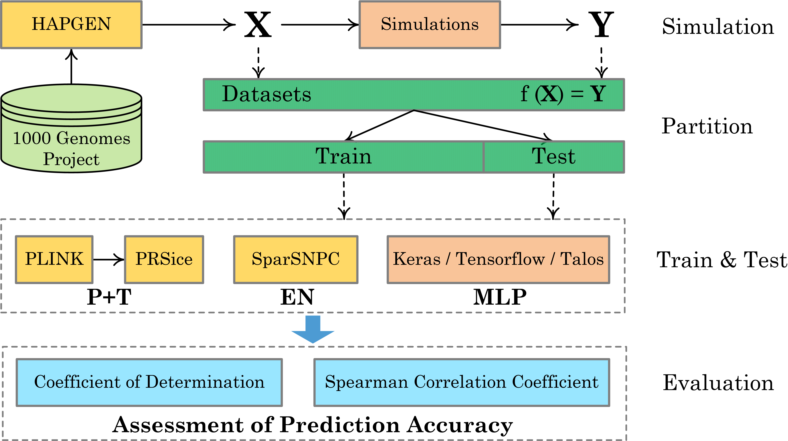

## 近期任务安排
- 看文献+完善项目申请书————陈婉君
- 调研数据下载方法，写好说明文档————任宏帅
- 从下载的数据转化为HAPGEN的输入————刘子豪
- 用PRScice跑EN模型————冯彦斌

## 待解决的问题
- ReferencePanel数据来源？
- PRScice跑EN模型？
- sklearn跑EN模型和MLP模型？重点是输入数据的处理？
- 实验结果文件及图表的含义？
- IMPUTE脚本的结果文件\*.hap和*.legend如何与下载的\*.map匹配作为HAPGEN一组输入？
- HAPGEN的输出结果如何转换为.HDF5文件，作为Simulations程序的输入？或者不使用HAPGEN，如何将一组\*.hap、\*.legend和\*.map文件转化为.HDF5文件？

## 已完成工作
- HAPGEN数据仿真流程及参数设置的含义
- PLINK的使用及跑P+T模型
- PRSice跑P+T模型
- [数据集下载](https://www.internationalgenome.org/data-portal/population/FIN):千人基因组计划中在芬兰地区的测序数据-[90个文件](90-dadaset-links.txt)

-----
## 方法框架

  

*Datasets: <https://www.internationalgenome.org>  
*Simulations: <https://github.com/JasonGrealey/Simulations>  

## 软件工具
- HAPGEN
  - [官网](https://mathgen.stats.ox.ac.uk/genetics_software/hapgen/hapgen2.html)
  - 输入：\*.hap, \*.legend, \*.map
  - 输出：
    - cases: \*.gen, \*.sample, \*.haps, \*.tags.gen
    - controls: \*.gen, \*.sample, \*.haps, \*.tags.gen
    - \*.legend (同输入)
    - \*.summary (日志文件)
- IMPUTE2
  - [官网](https://mathgen.stats.ox.ac.uk/impute/impute_v2.html#home)
  - 输入：\*.vcf
  - 输出：\*.hap, \*.legend
  - 运行脚本: [vcf2impute_legend_haps.pl](https://mathgen.stats.ox.ac.uk/impute/scripts/vcf2impute_legend_haps)
- PLINK
  - [官网](https://www.cog-genomics.org/plink/)
- PRSice
  - [Tutorial](https://choishingwan.github.io/PRSice/)
- PGS with PLINK/PRSice-2/LDpred-2/lassosum
  - [Tutorial](https://choishingwan.github.io/PRS-Tutorial/)
## 方法模型及实现工具
- **Additive PGS Method** (P+T)
  - PLINK
  - PRSice
- **Elastic Net PGS Method** (EN)
  - SparSNPC
- **Nultilayedered Perceptrons PGS Method** (MLP)
  - Keras
  - Tensorflow
  - Talos

## 相关资料
- [什么是多基因评分(Polygenic Scores)?](https://zhuanlan.zhihu.com/p/368701300), [英文版介绍](http://polygenicscores.org/explained/)
- [全基因组关联分析(Genome Wide Association Study)](https://baike.baidu.com/item/%E5%85%A8%E5%9F%BA%E5%9B%A0%E7%BB%84%E5%85%B3%E8%81%94%E5%88%86%E6%9E%90/9483732?fr=aladdin)
- [GWAS实验室](https://gwaslab.com/)
  - 该网站发布了大量关于遗传统计学方面的学习笔记
- 多基因风险分数 PRS( Polygenic risk score)
  - [系列之一：概念入门](https://zhuanlan.zhihu.com/p/396268778?ivk_sa=1024320u)
  - [系列之二：使用PLINK计算PRS（C+T方法）](https://zhuanlan.zhihu.com/p/401122336)
  - [系列之三：使用PRSice计算PRS（C+T方法）](https://zhuanlan.zhihu.com/p/407548340)
- [《统计遗传学：第五章 多基因得分(PGS)分析》](https://wenku.baidu.com/view/7a766a30f22d2af90242a8956bec0975f465a496?aggId=7a766a30f22d2af90242a8956bec0975f465a496&fr=catalogMain&_wkts_=1671794745568&bdQuery=Polygenic+scores+%28PGS%29)
- [冯彦斌-项目笔记](https://www.mubucm.com/doc/rpvKpUCTCS)
## 参考文献
- 
## 团队成员
- 陈婉君 21级本科生
- 刘子豪 21级本科生
- 冯彦斌 19级本科生
- 任宏帅 23级研究生
- 康国胜 指导老师
- 徐&ensp;&ensp;宇 指导老师
